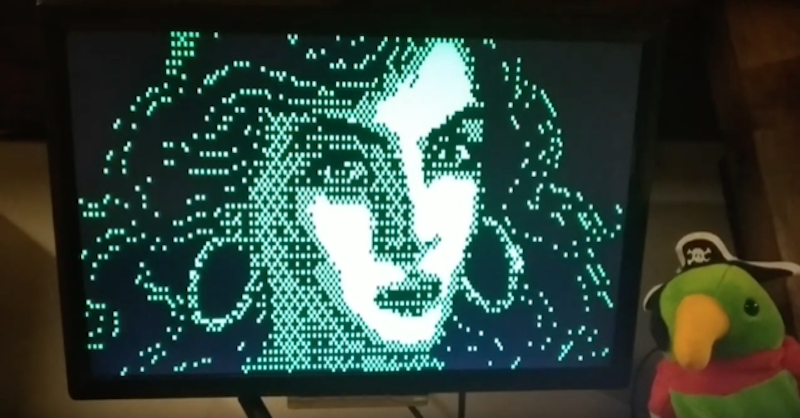
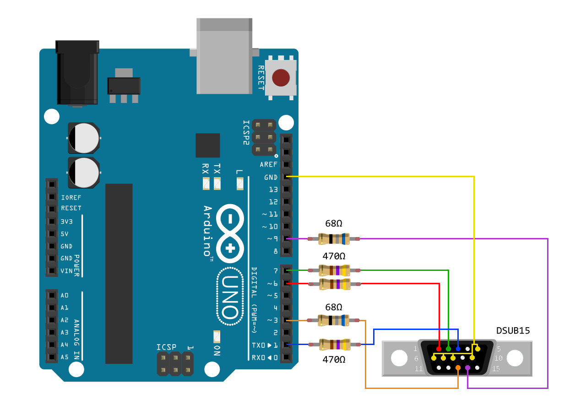
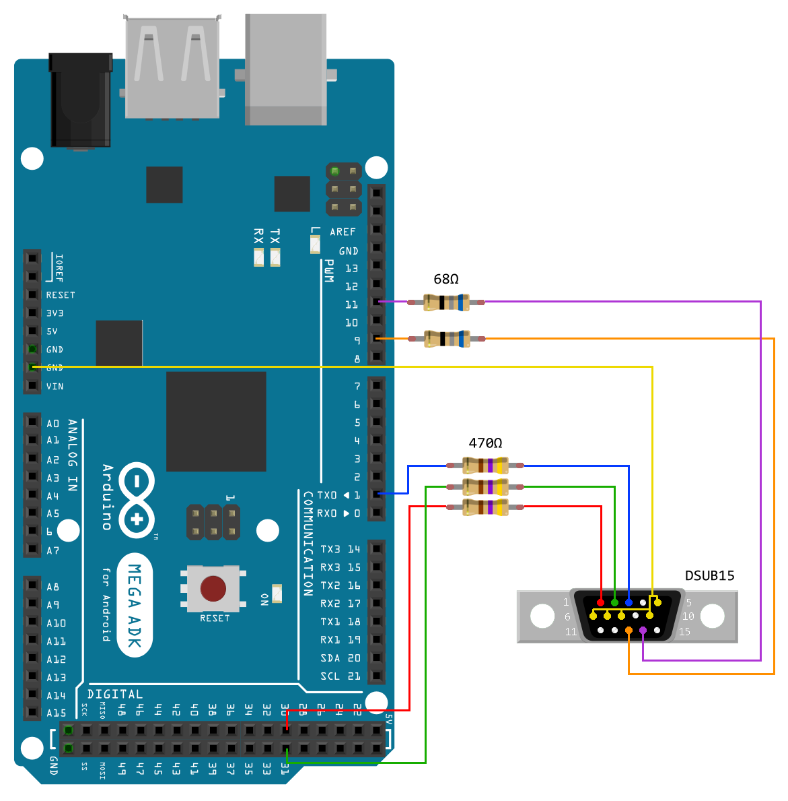
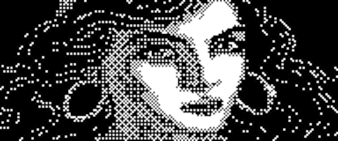
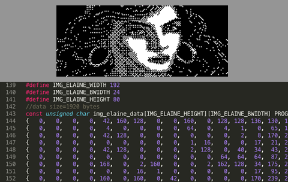
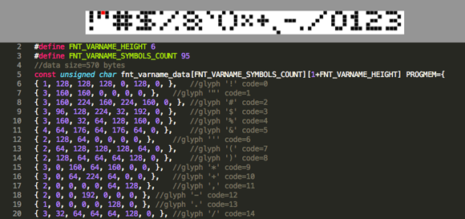

# VGAXUA Library for Arduino UNO and MEGA

COPYRIGHT (C) 2019 Sandro Maffiodo  
[smaffer@gmail.com](mailto:smaffer@gmail.com)  
[http://www.sandromaffiodo.com](http://www.sandromaffiodo.com)

YouTube videos:

Some photos:

 

## What is VGAXUA?

This is a VGA library for Arduino UNO and Arduino MEGA. It is based on my first [VGAX](https://github.com/smaffer/vgax) library.

To use this library you need only 3 resistors and one DSUB15 connector.  
This library require an ATMega328 MCU (or higher) MCU. Does not work with ATTINY family or ATMega168.

## Credits

Based on the [VGA color video generation](http://www.gammon.com.au/forum/?id=11608) by [Nick Gammon](http://www.gammon.com.au).  
AVR [interrupt dejitter](https://github.com/cnlohr/avrcraft/tree/master/terminal) from [Charles CNLOHR](https://github.com/cnlohr).  

Check out my others VGA libraries: [VGAX](https://github.com/smaffer/vgax), [ESPVGAX](https://github.com/smaffer/espvgax).

## Video

The library implement a 192x80px framebuffer where each pixel is stored as 1 bits (2 colors). On Arduino MEGA resolution can be increased to 200x240px.
The framebuffer is stored inside SRAM and require at least 1920 bytes. This mean that on ATMega328 your programs cannot use more than 128 bytes of SRAM so be carefull! If you want, you can use another Arduino UNO to drive the one that use VGAXUA library. On ATMega2560 you have more SRAM but if you expand the framebuffer to 200x240px free SRAM will be 2000 bytes.

VGAXUA framebuffer use 1 bit for each pixel. Inside each byte are stored 8 pixels, packed in a reversed order: rightmost pixel is on the most significant bit (LSB->MSB).

VGAXUA library use AVR UART serial bus to pipe out pixels, instead of software bitbanging like [VGAX](https://github.com/smaffer/vgax).

On Arduino MEGA (ATMega2560) framebuffer can be extended to 200x80px with squared pixels or 200x240px with rectangular pixels. You can enable this alternative resolution by uncommenting this constants on VGAXUA.h header:

	//uncomment ATMEGA2560_MAXRES to use 200x240px rectangular pixels
	//#define ATMEGA2560_MAXRES

### Artifact

The generated image has an artifact before each horizontal lines: 

This artifact is related to how UART internally works. I've tryed to remove this artifact but seems impossible. If your monitor has a configurable CLOCK PHASE and HORIZONTAL POSITION (almost all flat monitors has that) you can shift out the artifact from the visible pixels by moving the HORIZONTAL POSITION to the left and increase the CLOCK PHASE to match the horizontal width of the generated signal.

## Audio

This library does not support audio signal generation. Check out my [VGAX](https://github.com/smaffer/vgax) first library if you are interested about audio+video generation.

## Wiring

You need:

- 3x 470ohm resistors (2 of them resistors are optionals)
- 2x 68ohm resistors 
- 1x DSUB15 female connector

Then connect them like the following schema.  
*NOTE: The DSUB15 connector is shown from rear view*

*NOTE: PIN 6 and PIN 7 are optionals and are needed ONLY if you need Extended Colors (see next chapter)*

*NOTE: PIN 30 and PIN 31 are optionals and are needed ONLY if you need Extended Colors (see next chapter)*

### Extendend Colors

VGAXUA normally can display only 2 colors: black and PRIMARY. PRIMARY depends of how you wire up PIN 1 (TX) to one of the three VGA colors PINS (green, red, blue).

Additionally to the PRIMARY color you can enable Extended Colors using the **setExtendedColorsMask()** method and wiring up two additional PINS (6,7 on ATMega328, 30,31 on ATMega2560). These PINS will be toggle UP or DOWN dynamically but for all the horizontal lines, so you cannot toggle them between pixels or between lines but only on ALL horizontal lines.

Here it is an example of the results:

As you can see in the image, the Extended Colors affect only a portion of the full framebuffer. This is originated by the timing required to toggle OFF the Extended Colors PINS. 

The number of excluded columns pixels for Extended Colors is defined in the VGAX_ECSWIDTH constant. You can use this constant in your code. This constant is defined differently in ATMega328 and ATMega2560 due to different timings in the signal generation:

	//Extended Colors SKIP Width
	#if defined(__AVR_ATmega2560__)
	  #define VGAX_ECSWIDTH 11
	#else
	  #define VGAX_ECSWIDTH 3
	#endif

The following is an example of wiring with PRIMARY (P) color BLUE and Extended Colors (EC) GREEN and RED:

You can swap PIN wiring to obtain different colors combinations.

## PIN and PORT

Video generation is implemented using PORTD, so **you cannot use any of the
PORTD pins**.

On Arduino UNO the vertical synchronization signal is generated on pin 9. 

On Arduino MEGA PORTD is substituted to PORTA, vertical sync is PIN 11 and horizontal sync is PIN 9.

## Interrupt

VGAXUA library, like [VGAX](https://github.com/smaffer/vgax), generates the video signal using only interrupts, so, inside main() function, you can do anything you want. Your code will be interrupted when VGA signal needs to be generated.

[Nick Gammon](http://www.gammon.com.au/forum/?id=11608)'s original code generate the line pixels inside main(). I prefer to generate the line inside interrupts to keep the MCU free to do some other things, like run games or play sounds.

**WARNING: You cannot add other interrupts or the VGA signal generation will be unstable.**

## Timers

This library uses **all the 3 timers** of ATMega328 MCU. On ATMega2560 there are more unused timers.

*TIMER1* and *TIMER2* are configured to generate HSYNC and VSYNC pulses.
The setup code for these two timers has been [created by Nick Gammon](http://www.gammon.com.au/forum/?id=11608).
I have only made some modifications to use pin 9 instead of pin 10. On ATMega2560 HSYNC and VSYNC are different.

*TIMER0* is used to fix the interrupt jitter. I have modified an assembler trick
originally writen by [Charles CNLOHR](https://github.com/cnlohr/avrcraft/tree/master/terminal).

By default the *TIMER0* is used by Arduino to implement these functions:
 
	unsigned millis();
	unsigned long micros();
	void delay(ms); 
	void delayMicroseconds(us);

Instead of using these functions, you should use the alternative versions
provided by my library.

VGAXUA provides an alternative version of **rand()** that can be used to reduce the SRAM memory usage:

	unsigned rand();

## Library usage

To use the VGAXUA library you need to include its header

    #include <VGAXUA.h>

VGAXUA class is static, so you can use the class without create an instance of it:

    void setup() {
      VGAXUA::begin();
    }

Or, if you prefer, you can create your instance, but keep in mind that cannot be
more than one VGAXUA instance at a time:

    VGAXUA vga;

    void setup() {
      vga.begin();
    }

### Pixels

A simple example of putpixel function:

	 #include <VGAXUA.h>
	
	VGAXUA vga;
	
	void setup() {
	  vga.begin();
	  vga.clear(91);
	  for (int y=0; y!=VGAX_HEIGHT; y++) {
	    for (int x=0; x!=VGAX_WIDTH; x++) {
	      if (x==0 || x==VGAX_WIDTH-1 || y==0 || y==VGAX_HEIGHT-1)
	        vga.putpixel(x, y, 1);
	      else
	        vga.putpixel(x, y, VGAXUA::rand()%2);
	    }
	  }
	}
	void loop() {
	  VGAXUA::setExtendedColorsMask(0);
	}
    
### Images

This example show the **copy()** method. The copy function copy all pixels from an array of bytes. The array **must** be stored in PROGMEM and the size of the
array must be equal to the VGAXUA framebuffer:
 
    VGAX_BWIDTH * VGAX_HEIGHT
    (24 * 80)

*NOTE(1) copy() method require an image with pixels packed in the reversed order (LSB->MSB). If you use my 1bitimage tool there is an option to generate reversed bits instead of unreversed ones.*

*NOTE(2) the size in bytes is calculated using BWIDTH instead of WIDTH, because pixels are packed into bytes (8 pixels in one byte).*

	 #include <VGAXUA.h>
	
	//image generated from 1BITIMAGE - by Sandro Maffiodo
	#define IMG_ELAINE_WIDTH 192
	#define IMG_ELAINE_BWIDTH 24
	#define IMG_ELAINE_HEIGHT 80
	//data size=1920 bytes
	const unsigned char img_elaine_data[IMG_ELAINE_HEIGHT][IMG_ELAINE_BWIDTH] PROGMEM={
	{   0,   0,   0,   0,  42, 160, 128,   0,   0, 160,   0, 128, 128, 136, 130, 170, 160,  40,   0,   0,   0,   0,   0,   0, },
	{   0,   0,   0,   0,   4,   0,   0,   0,   0,  64,   0,   4,   1,   0,  65, 127,  64,   4,   0,   0,   0,   0,   0,   0, },
	{   0,   0,   0,   0,  42, 128,   0,   0,   0,   0,   0,   0,   2,   8, 170, 255, 168,   0,   0,   0,   0,   0,   0,   0, },
	{   0,   0,   0,   0,   0,   0,   0,   0,   0,   1,  16,   0,   0,  17,  21, 255, 208,   0,   0,   0,   0,   0,   0,   0, },
	{   0,   0,   0,   0,  42, 128,   0,   0,   0,   2, 128,   0,  40,  34,  43, 255, 234,   0,   2,   0,   0,   0,   0,   0, },
	{   0,   0,   0,   0,   0,   0,   0,   0,   0,   0,   0,  64,  64,  64,  87, 255, 240,   0,  64,   0,   0,   0,   0,   0, },
	{   0,   0,   0,   0, 168,   0,   2, 160,   0,   0,   2, 162, 128,  34, 175, 255, 250,   0,  34,   0,   0,   0,   0,   0, },
	{   0,   0,   0,   0,   0,   0,  16,   1,   0,   0,   0,   0,   0,  17,  95, 255, 244,   0,   0,   0,   0,   0,   0,   0, },
	{   0,   0,   0,   0, 160,   0, 160,   0,  42,   0,   0,   0,   0, 170, 239, 255, 250,   0,  34,   0,   0,   0,   0,   0, },
	{   0,   0,   0,   0,   4,   5,   0,   0,   4,  64,   0,   0,   4,  85, 223, 255, 252,   0,   0,  64,   0,   0,   0,   0, },
	{   0,   0,   0,   0,   0,  10,   0,   0,   0,  42, 128, 170, 168, 175, 191, 255, 254, 128,   2,   8,   0,   0,   0,   0, },
	{   0,   0,   0,   1,   0,   0,   0,   0,   0,   0,  16,   0,   0,  87, 255, 255, 252,   0,   1,   1,   0,   0,   0,   0, },
	{   0,   0,   0,  40,   8,  32,   0, 170, 128,   0,  42,   0,  42, 175, 255, 255, 254,   0,   2,   8, 128,   0,   0,   0, },
	{   0,   0,   0,  64,   0,   0,   4,   0,  68,   0,   0,   0,  69, 127, 255, 255, 255,   0,   0,   0,  64,   0,   0,   0, },
	{   0,   0,   2,   2, 128,   0,  40,   0,   0, 170, 170, 168, 171, 255, 255, 255, 250, 160,   8,  32,  32,   0,   0,   0, },
	{   0,   0,   0,  16,   0,   0,   0,   0,   0,   0,   0,   1,  87, 255, 255, 255, 240,   0,   0,   0,  16,   0,   0,   0, },
	{   0,   0,   8,  32,   0,   2,   2, 130, 128,   0, 170, 170, 171, 255, 255, 255, 128,   0,   0,   0,   8,   0,   0,   0, },
	{   0,   0,   0,  64,   0,   0,   0,   0,  68,  68,   5,  85,  87, 255, 255, 253,   0,   0,   4,   0,   0,   0,   0,   0, },
	{   0,   0,   0,   0,   0,   8,  40,   2,  42, 170, 128,  14, 175, 255, 255, 252,  10, 160,   2,   0,  32,   0,   0,   0, },
	{   0,   1,   0,   0,   0,   0,   0,   0,  17,   0,   0,   0,  85, 127, 255, 240,   5,  64,   1,   1,  16,   0,   0,   0, },
	{   0,   2,   8,   0,   0,   0, 160,  32, 170, 160,  32,   0,  10, 191, 255, 128,  42, 160,   0,   0, 130,   0,   0,   0, },
	{   0,   0,   0,   0,   0,   0,   0,  68,   4,   0,   0,   0,   1,  87, 255,   0,   1,  64,   0,   0,   0,   0,   0,   0, },
	{   0,   0,   0,   0,   0, 138,   0,   0, 170, 130, 170, 170,   0,  43, 250,  10,   2, 160,   0,   0,  10,   0,   0,   0, },
	{   0,   0,   0,   0,   0,   0,   0,   0,  17,   0,   0,   1,   0,  23, 245,   0,   0,   0,   0,  16,   1,   0,   0,   0, },
	{   0,   0,  32,   2, 136,   0,   0,   8,  42,  34,  34, 170, 170,  43, 250,  32,  56,   0,   0,   0,   8,   0,   0,   0, },
	{   0,   0,  64,   0,   4,   0,   4,   1,  68,   0,   0,   0,  69,   5, 252,   4,  12,   0,   0,   0,  65,   0,   0,   0, },
	{   0,   8,   0,   0,   0,  42, 160,   0, 168, 170, 160,   0,  42, 175, 254, 140,  46,   0,   0,   0, 130,   0,   0,   0, },
	{   0,  16,   0,   0,   0,   0,   0,   0,  17,  16,   0,   0,   1,   1, 252,   0,  16,   0,   0,  16,  16,   0,   0,   0, },
	{   0,   0, 128,   2, 128,   0,   0, 138, 170, 170,   0,  26, 138, 162, 254,  42, 160,  32,   0,  32,   2,   0,   0,   0, },
	{   0,   0,   0,   0,   0,   0,   4,   0,  68,  64,   4,   1,  68,  65, 252,   0,   0,   0,   0,   0,   0,   0,   0,   0, },
	{   0,  32, 128,   0,   2, 170, 160,  34, 170, 168,  44, 166, 162, 170, 254, 170, 170, 160,   0,   2,  32,   0,   0,   0, },
	{   0,   0,   0,   0,   0,   0,   0,   1,  17,   0,   4,   5,   1,  16, 126,  23, 213,   0,   0,   0,   0,   0,   0,   0, },
	{   0,   0,   0, 128,   0,   0,   0, 138, 170,  34,  10, 168,  34, 170, 254, 191, 255, 160,   0, 128,   0,   0,   0,   0, },
	{   0,   0,   0,   0,   0,   0,   0,   5,  68,   0,   0,   0,   4,  68, 127, 127, 255, 192,   0,   0,  68,   0,   0,   0, },
	{   0,   0,   8,   0,   0,   0,  40,  42, 170, 170, 170, 170, 170, 170, 191, 255, 255, 232,   2,   0, 130, 160,   0,   0, },
	{   0,   0,   0,   0,   0,   0,   0,  17,  16,  21,  80,   0,  64,  17, 127, 255, 255, 192,   0,   0,   0,  17,   0,   0, },
	{   0,  32,   2,   0,   0, 160,   0,  42, 170,  42, 250, 170, 162,  42,  63, 255, 255, 160,   0,   0, 128,   0, 128,   0, },
	{  64,  68,   0,   0,   4,   0,   0,   4,  68,  21, 125,  85,  80,   4,  31, 255, 255, 192,   0,   4,   0,   0,   0,   0, },
	{  10,   0, 130,   0,   0,   0,  42, 170, 170, 171, 255, 255, 234, 170, 175, 255, 255, 168,   8,   2, 128,  40,   8,   2, },
	{   0,   0,   0,   0,   0,   1,   0,   1,  16,  23, 255, 255, 240,  17,  31, 255, 255, 192,   0,   0,   0,   0,   0,   1, },
	{  42, 128,   0,  32,   0, 162,  34,  42, 170,  42, 255, 255, 250,  42,  47, 255, 255, 160,   0,   0,   2, 128, 162,   0, },
	{   0,   0,   0,   0,   4,   0,   4,   5,  68,  21, 255, 255, 244,   5,  31, 255, 255, 197,   4,   0,   0,  64,  65,   0, },
	{   0,   0,  32,   0, 160,   0, 170,  42, 170, 170, 255, 255, 254, 170, 175, 255, 255, 162, 194,   0,   0,  32,  40, 128, },
	{   0,   0,   0,   0,   0,   0,   0,   1,   1,   5, 127, 255, 244,   1,  31, 255, 255,  64,  16,   0,   0,   0,  16,   1, },
	{   0,  42,   0,   0,   0, 168,  34,  42, 162, 162, 255, 255, 250,  42,  47, 255, 255, 160,  40, 128,   0,   0,   2,  32, },
	{   0,  64,   4,   0,   4,   0,   4,   4,  64,  65, 127, 255, 248,   1,  23, 247, 255,   0,   4,   4,   0,   0,   0,   4, },
	{   2,   0, 160,  32, 160,   6, 170, 170, 170, 170, 191, 255, 250, 170, 171, 235, 254, 128,  10,   0, 160,   0,   8, 128, },
	{   0,   0,   0,   0,   0,  17,   0,   1,  16,   0,  95, 255, 248,  21,   5,  23, 255,   0,   1,   0,   0,   1,   0,   0, },
	{   0,  40,   0, 136,   0,  40,   2,  34, 170,  34,  47, 255, 250,  34,  34, 175, 254,   0,   2, 160,   0, 128,   0,   0, },
	{  64,   0,   0,   0,   0,  64,   0,   1,  68,   0,  23, 255, 244,   0,   1, 127, 252,   0,   1, 208,   0,   0,   4,   0, },
	{ 130, 128,   0,   0,   0, 160,   0,  42, 170, 170, 171, 255, 254, 170, 174, 255, 254, 128,   2, 224,   0,   8, 130,   0, },
	{   0,   0,   0,   0,   1,   0,   0,  17,  16,   0,   7, 255, 253,  80,   5, 255, 252,   0,   0,  80,   0,   0,   0,   0, },
	{   8,   0,   8,   0,   1, 128,   0,  42, 170,  34,  42, 255, 255, 250, 171, 255, 250,   0,   0, 184,   0,   0,   0,   0, },
	{   0,   0,   0,   0,   0,   0,   0,   0,  68,   0,  85, 255, 255, 255, 119, 255, 244,   0,   0, 112,   0,   0,   4,  64, },
	{   0,   0,   2,   0,   6,   0,   0,  40, 170, 170, 170, 191, 255, 255, 170, 255, 234,   0,   0, 168,   0,   0,   2,  32, },
	{  16,   0,  16,   0,   5,   0,   0,  16,  17,   0,  85, 127, 255, 255, 193,  87, 208,   0,   0,   0,   0,   0,   1,  16, },
	{   0,   0,  32,   0,   2,   0,   0,  32, 170, 162,  42, 191, 255, 255, 170, 171, 235,   0,   0, 160,   0,   0,  32, 128, },
	{   0,   0,   5,   0,   4,   0,   0,  68,  69,  64,  21, 127, 255, 245,  84,   1, 209, 128,   0,  64,   0,   0,   0,  68, },
	{   0,   0,   0, 168,  10,   0,   0, 168,  42, 170, 170, 191, 254, 174, 170, 163, 170, 192,   0, 162,   0,   0,   8,   0, },
	{   0,   0,   0,   0,   0,   0,   0,   0,  17,  17,   5,  95, 255,  64,   0,   1, 208,  32,   0,   0,   0,   0,   0,   0, },
	{   0,   0,   2, 168, 138,   0,   1, 130,  42, 170, 162, 191, 254,  32,   2,  35, 160, 184,   0, 128,   8,   0,   0,  40, },
	{  64,   0,   0,   4,  68,   0,   0,  64,  68,  68,  65,  95, 252,   0,   0,   5,  64,  68,   0,  68,   0,   0,   4,   4, },
	{  42,   0,   0,   2,  10,   0,   6, 138,  42, 170, 170, 175, 254, 170, 170, 170, 160,  10, 138, 128, 130,   0,   0,   2, },
	{   0,   0,   0,   0,   0,   0,   1,   0,  17,  17,  16,  87, 255,   0,   0,  87,  64,   1,   1,   0,   0,   0,   0,   1, },
	{ 128,  32,   0,   2,   3,   0,  26,   2,  42, 162, 170,  43, 255, 250,  34, 190, 160,   0, 168,   0,   0, 128,   2,   0, },
	{   4,   0,   0,   0,  69,   0,  68,   4,  69,  65,  68,   5, 127, 255,  80, 255,  64,   0,   0,   0,   0,   0,   0,   0, },
	{   0,  32,   0,   0,   2, 239, 160,   8,  42, 170, 170, 170, 191, 255, 255, 254, 136,   0,   0,   0,   8,   0,   0,   0, },
	{   0,   0,   0,   0,   0,  17,   0,   0,  17,  16,  17,   1,  95, 255, 255, 253,   0,   0,   0,   0,   0,   0,   0,   0, },
	{   8,  32,   0,   8, 128,  42,   0,   0,  42, 170, 170, 162,  47, 255, 255, 250,   2,   0,   0,   0,   8,  32,   0,   0, },
	{  64,  64,   0,   0,   0,   0,   0,   0,   4,  64,   0,  64,  21, 255, 255, 253,   0,  64,   0,   0,   0,   0,   4,   0, },
	{   0,   0,   0,   2,   0,   0,   0,   0, 170, 170, 170, 170, 170, 255, 255, 250, 128,   2,   0,   0,   0,   0, 136,  32, },
	{   0,   0,   0,   0,   0,   0,   0,   0,  17,  16,   1,  16,   5, 127, 255, 244,   0,   0,   0,   0,   0,   0,   0,   0, },
	{ 168,   0,   0, 128,   0,   0,   2,   2,  42, 170,  34, 170, 162, 170, 254, 170,   0,   0,   8,   0,   0, 128,   0, 128, },
	{   0,   0,   4,   0,   0,   0,   4,   0,   5,  68,   0,  69,  64,  21,  85,  80,   0,   0,   4,   0,  64,   0,  64,   0, },
	{   0,   0,  32,  32,   0,   0,   0,   2, 170, 170, 170, 170, 170, 170, 170, 160,  32,  40,   2,   0,   2,   2, 128,   0, },
	{   0,   0,   1,   0,   0,   0,   0,   0,   1,  16,   0,   0,   0,   0,   0,   0,   0,   0,   0,   0,   0,   1,   0,   1, },
	{   0,   0,   2,   0,   0, 160,   0, 138, 170, 170,  42, 162,  42, 162,  34, 160,   0,   0,   0,   0,   0,   2,   0,  34, },
	{   0,   0,   0,   0,  68,   0,   0,   0,   0,  68,   4,  68,  21,  68,   4,  68,   0,   0,   0,   4,   0,   4,   4,   0, },
	{   0,   8,  32,   2, 128,   0,   2, 170, 170, 170, 170, 170, 170, 170, 170, 170, 128,   0,  32,   8,   0,   0,   0,   0, },
	{   0,  16,   0,   0,   0,   0,   1,   0,   1,   0,   1,  16,  21,  85,  17,   1,   0,   0,   0,  16,   0,   0,   0,   0, },
	};
	VGAXUA vga;
	
	void setup() {
	  vga.begin();
	  vga.copy((byte*)img_elaine_data);
	}
	void loop() {
	  vga.setExtendedColorsMask(0);
	}

### Sprites

    #include <VGAXUA.h>

	...
    VGAXUA vga;

    void setup() {
      vga.begin();
      vga.clear(0);
    }
    void loop() {
      static byte sidx=1;
      static unsigned cnt;
      vga.blitwmask((byte*)(img_mario_data[sidx]), (byte*)(img_mariomask_data[sidx]), IMG_MARIO_WIDTH, IMG_MARIO_HEIGHT, rand()%VGAX_WIDTH-IMG_MARIO_WIDTH/2, rand()%VGAX_HEIGHT-IMG_MARIO_HEIGHT/2);
      sidx=sidx==1 ? 2 : 1;
      if (cnt>=180) {
        cnt=0;
        vga.clear(0);
      }
    }

### Fonts

You can use my 1bitfont tool to create your fonts. I have designed two super small fonts that can be used with VGAXUA or with others projects. Here they are:

**ufont.png**: 

**ufont2.png**: 

The following example use the first font.

    #include <VGAXUA.h>
	
	//font generated from 1bitfont - by Sandro Maffiodo
	#define FNT_NANOFONT_HEIGHT 6
	#define FNT_NANOFONT_SYMBOLS_COUNT 95
	//data size=570 bytes
	const unsigned char fnt_nanofont_data[FNT_NANOFONT_SYMBOLS_COUNT][1+FNT_NANOFONT_HEIGHT] PROGMEM={
	{ 1, 128, 128, 128, 0, 128, 0, }, //glyph '!' code=0
	{ 3, 160, 160, 0, 0, 0, 0, }, //glyph '"' code=1
	{ 5, 80, 248, 80, 248, 80, 0, },  //glyph '#' code=2
	{ 5, 120, 160, 112, 40, 240, 0, },  //glyph '$' code=3
	{ 5, 136, 16, 32, 64, 136, 0, },  //glyph '%' code=4
	{ 5, 96, 144, 104, 144, 104, 0, },  //glyph '&' code=5
	{ 2, 128, 64, 0, 0, 0, 0, },  //glyph ''' code=6
	{ 2, 64, 128, 128, 128, 64, 0, }, //glyph '(' code=7
	{ 2, 128, 64, 64, 64, 128, 0, },  //glyph ')' code=8
	{ 3, 0, 160, 64, 160, 0, 0, },  //glyph '*' code=9
	{ 3, 0, 64, 224, 64, 0, 0, }, //glyph '+' code=10
	{ 2, 0, 0, 0, 0, 128, 64, },  //glyph ',' code=11
	{ 3, 0, 0, 224, 0, 0, 0, }, //glyph '-' code=12
	{ 1, 0, 0, 0, 0, 128, 0, }, //glyph '.' code=13
	{ 5, 8, 16, 32, 64, 128, 0, },  //glyph '/' code=14
	{ 4, 96, 144, 144, 144, 96, 0, }, //glyph '0' code=15
	{ 3, 64, 192, 64, 64, 224, 0, },  //glyph '1' code=16
	{ 4, 224, 16, 96, 128, 240, 0, }, //glyph '2' code=17
	{ 4, 224, 16, 96, 16, 224, 0, },  //glyph '3' code=18
	{ 4, 144, 144, 240, 16, 16, 0, }, //glyph '4' code=19
	{ 4, 240, 128, 224, 16, 224, 0, },  //glyph '5' code=20
	{ 4, 96, 128, 224, 144, 96, 0, }, //glyph '6' code=21
	{ 4, 240, 16, 32, 64, 64, 0, }, //glyph '7' code=22
	{ 4, 96, 144, 96, 144, 96, 0, },  //glyph '8' code=23
	{ 4, 96, 144, 112, 16, 96, 0, },  //glyph '9' code=24
	{ 1, 0, 128, 0, 128, 0, 0, }, //glyph ':' code=25
	{ 2, 0, 128, 0, 0, 128, 64, },  //glyph ';' code=26
	{ 3, 32, 64, 128, 64, 32, 0, }, //glyph '<' code=27
	{ 3, 0, 224, 0, 224, 0, 0, }, //glyph '=' code=28
	{ 3, 128, 64, 32, 64, 128, 0, },  //glyph '>' code=29
	{ 4, 224, 16, 96, 0, 64, 0, },  //glyph '?' code=30
	{ 4, 96, 144, 176, 128, 112, 0, },  //glyph '@' code=31
	{ 4, 96, 144, 240, 144, 144, 0, },  //glyph 'A' code=32
	{ 4, 224, 144, 224, 144, 224, 0, }, //glyph 'B' code=33
	{ 4, 112, 128, 128, 128, 112, 0, }, //glyph 'C' code=34
	{ 4, 224, 144, 144, 144, 224, 0, }, //glyph 'D' code=35
	{ 4, 240, 128, 224, 128, 240, 0, }, //glyph 'E' code=36
	{ 4, 240, 128, 224, 128, 128, 0, }, //glyph 'F' code=37
	{ 4, 112, 128, 176, 144, 112, 0, }, //glyph 'G' code=38
	{ 4, 144, 144, 240, 144, 144, 0, }, //glyph 'H' code=39
	{ 3, 224, 64, 64, 64, 224, 0, },  //glyph 'I' code=40
	{ 4, 240, 16, 16, 144, 96, 0, },  //glyph 'J' code=41
	{ 4, 144, 160, 192, 160, 144, 0, }, //glyph 'K' code=42
	{ 4, 128, 128, 128, 128, 240, 0, }, //glyph 'L' code=43
	{ 5, 136, 216, 168, 136, 136, 0, }, //glyph 'M' code=44
	{ 4, 144, 208, 176, 144, 144, 0, }, //glyph 'N' code=45
	{ 4, 96, 144, 144, 144, 96, 0, }, //glyph 'O' code=46
	{ 4, 224, 144, 224, 128, 128, 0, }, //glyph 'P' code=47
	{ 4, 96, 144, 144, 144, 96, 16, },  //glyph 'Q' code=48
	{ 4, 224, 144, 224, 160, 144, 0, }, //glyph 'R' code=49
	{ 4, 112, 128, 96, 16, 224, 0, }, //glyph 'S' code=50
	{ 3, 224, 64, 64, 64, 64, 0, }, //glyph 'T' code=51
	{ 4, 144, 144, 144, 144, 96, 0, },  //glyph 'U' code=52
	{ 3, 160, 160, 160, 160, 64, 0, },  //glyph 'V' code=53
	{ 5, 136, 168, 168, 168, 80, 0, },  //glyph 'W' code=54
	{ 4, 144, 144, 96, 144, 144, 0, },  //glyph 'X' code=55
	{ 3, 160, 160, 64, 64, 64, 0, },  //glyph 'Y' code=56
	{ 4, 240, 16, 96, 128, 240, 0, }, //glyph 'Z' code=57
	{ 2, 192, 128, 128, 128, 192, 0, }, //glyph '[' code=58
	{ 5, 128, 64, 32, 16, 8, 0, },  //glyph '\' code=59
	{ 2, 192, 64, 64, 64, 192, 0, },  //glyph ']' code=60
	{ 5, 32, 80, 136, 0, 0, 0, }, //glyph '^' code=61
	{ 4, 0, 0, 0, 0, 240, 0, }, //glyph '_' code=62
	{ 2, 128, 64, 0, 0, 0, 0, },  //glyph '`' code=63
	{ 3, 0, 224, 32, 224, 224, 0, },  //glyph 'a' code=64
	{ 3, 128, 224, 160, 160, 224, 0, }, //glyph 'b' code=65
	{ 3, 0, 224, 128, 128, 224, 0, }, //glyph 'c' code=66
	{ 3, 32, 224, 160, 160, 224, 0, },  //glyph 'd' code=67
	{ 3, 0, 224, 224, 128, 224, 0, }, //glyph 'e' code=68
	{ 2, 64, 128, 192, 128, 128, 0, },  //glyph 'f' code=69
	{ 3, 0, 224, 160, 224, 32, 224, },  //glyph 'g' code=70
	{ 3, 128, 224, 160, 160, 160, 0, }, //glyph 'h' code=71
	{ 1, 128, 0, 128, 128, 128, 0, }, //glyph 'i' code=72
	{ 2, 0, 192, 64, 64, 64, 128, },  //glyph 'j' code=73
	{ 3, 128, 160, 192, 160, 160, 0, }, //glyph 'k' code=74
	{ 1, 128, 128, 128, 128, 128, 0, }, //glyph 'l' code=75
	{ 5, 0, 248, 168, 168, 168, 0, }, //glyph 'm' code=76
	{ 3, 0, 224, 160, 160, 160, 0, }, //glyph 'n' code=77
	{ 3, 0, 224, 160, 160, 224, 0, }, //glyph 'o' code=78
	{ 3, 0, 224, 160, 160, 224, 128, }, //glyph 'p' code=79
	{ 3, 0, 224, 160, 160, 224, 32, },  //glyph 'q' code=80
	{ 3, 0, 224, 128, 128, 128, 0, }, //glyph 'r' code=81
	{ 2, 0, 192, 128, 64, 192, 0, },  //glyph 's' code=82
	{ 3, 64, 224, 64, 64, 64, 0, }, //glyph 't' code=83
	{ 3, 0, 160, 160, 160, 224, 0, }, //glyph 'u' code=84
	{ 3, 0, 160, 160, 160, 64, 0, },  //glyph 'v' code=85
	{ 5, 0, 168, 168, 168, 80, 0, },  //glyph 'w' code=86
	{ 3, 0, 160, 64, 160, 160, 0, },  //glyph 'x' code=87
	{ 3, 0, 160, 160, 224, 32, 224, },  //glyph 'y' code=88
	{ 2, 0, 192, 64, 128, 192, 0, },  //glyph 'z' code=89
	{ 3, 96, 64, 192, 64, 96, 0, }, //glyph '{' code=90
	{ 1, 128, 128, 128, 128, 128, 0, }, //glyph '|' code=91
	{ 3, 192, 64, 96, 64, 192, 0, },  //glyph '}' code=92
	{ 3, 96, 192, 0, 0, 0, 0, },  //glyph '~' code=93
	{ 4, 48, 64, 224, 64, 240, 0, },  //glyph '£' code=94
	};
	VGAXUA vga;
	
	static const char str0[] PROGMEM="        VGAXUA Hello World!";
	static const char str1[] PROGMEM="        by Sandro Maffiodo";
	static char x=-VGAX_WIDTH;
	
	void setup() {
	  vga.begin();
	  vga.clear(0);
	}
	void loop() {
	  vga.clear(11);
	  vga.printPROGMEM((byte*)fnt_nanofont_data, FNT_NANOFONT_SYMBOLS_COUNT, FNT_NANOFONT_HEIGHT, 3, 1, str0, x, VGAX_HEIGHT/2-3, 0);
	  vga.printPROGMEM((byte*)fnt_nanofont_data, FNT_NANOFONT_SYMBOLS_COUNT, FNT_NANOFONT_HEIGHT, 3, 1, str1, x, VGAX_HEIGHT/2+4, 0);
	  x++;
	  if (x==VGAX_WIDTH)
	    x=-VGAX_WIDTH;
	  vga.delay(17);
	  vga.setExtendedColorsMask(0);
	}

## Tools

### 1bitimage

To convert an image to the VGAXUA format (1bit per pixel) i wrote a simple webapp that reads an image and create a C/C++ source file to be used with VGAXUA.

The source file of the webapp is inside the tools directory. You can open 1bitimage.html with your webbrowser and run it locally. I use Google Chrome, dunno if works with other webbrowsers.

### 1bitfont

With 1bitfont you can create your fonts from a single image and convert them to be used with VGAXUA library. The tool reads an image that contains all font's glyphs are separated from a vertical blank line. All glyphs are extracted and converted to a C/C++ source file.

1bitfont is a webapp, like 1bitimage, that can run locally on your webbrowser.
    
## FAQ

- How can i prevent screen flickering? At this time there is no one mechanism to prevent the flickering. The right way to prevent flicker is to use a double (frame)buffer but there isn't enought free memory to do that.
- Why there are so many NOP inside UART pixels generation? These NOP are needed to wait UART to push out all pixels without display any gap between each 8 pixels columns
- Why there is always a call to setExtendedColorsMask inside loop? This is needed to keep the UART signal stable. I've tryed to keep the signal stable without the need to call this method but, for now, i was not able to remove that

## Happy hacking

If you find a way to optimize the speed of the library let me know!

If you use VGAXUA for some sketches, please let me know that. I will insert your projects in a dedicated chapter!

Happy hacking!
